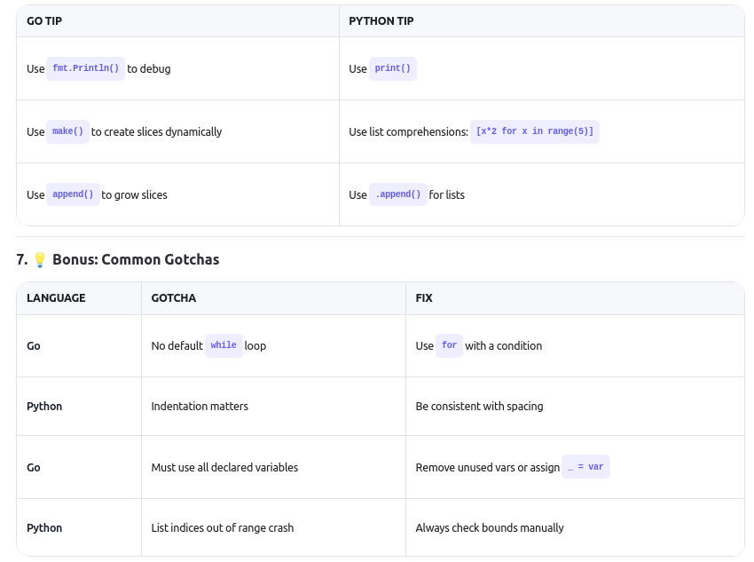

# 🧾 Go vs Python: Cheat Sheet for Algorithm Problems

This cheat sheet helps you switch between Go and Python when solving data structure and algorithm problems.

---

## 1. 📦 Variables & Data Types

| Task | Go | Python |
|------|----|--------|
| Declare integer | `var x int = 5` or `x := 5` | `x = 5` |
| Boolean | `true`, `false` | `True`, `False` |
| Array/Slice | `arr := []int{1,2,3}` | `arr = [1, 2, 3]` |
| Length of array | `len(arr)` | `len(arr)` |
| Empty slice | `[]int{}` | `[]` |

---

## 2. 🔁 Loops

| Task | Go | Python |
|------|----|--------|
| Loop from 0 to n-1 | `for i := 0; i < n; i++` | `for i in range(n):` |
| Loop with index over slice | `for i := range arr` | `for i in range(len(arr)):` |
| While loop | `for condition { ... }` | `while condition:` |
| Infinite loop | `for { ... }` | `while True:` |

---

## 3. 🧮 Arithmetic

| Operation | Go | Python |
|----------|----|--------|
| Integer division (`5 / 2`) | `5 / 2 → 2` | `5 // 2 → 2` |
| Modulo | `5 % 2` | `5 % 2` |
| Power (`2^3`) | Not built-in (use `math.Pow`) | `2 ** 3` |

---

## 4. 🧠 Conditionals

| Task | Go | Python |
|------|----|--------|
| If statement | `if x > 5 { ... } else { ... }` | `if x > 5: ... elif x == 5: ... else: ...` |
| Logical AND/OR/NOT | `&&`, `||`, `!` | `and`, `or`, `not` |

---

## 5. ✅ Example: Heap Validator

### Go Version:
```go
func isMinHeap(arr []int) bool {
    n := len(arr)
    for i := 0; i < n/2; i++ {
        left := 2*i + 1
        right := left + 1

        if left < n && arr[left] < arr[i] {
            return false
        }
        if right < n && arr[right] < arr[i] {
            return false
        }
    }
    return true
}
```

### Python Version: 
```python
def is_min_heap(arr):
    n = len(arr)
    for i in range(n // 2):
        left = 2 * i + 1
        right = left + 1

        if left < n and arr[left] < arr[i]:
            return False
        if right < n and arr[right] < arr[i]:
            return False
    return True
```

They look very similar — just different syntax!

### 6. 🛠 Tools & Tips

