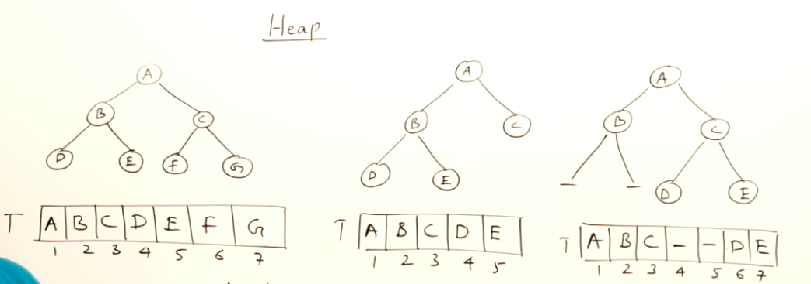
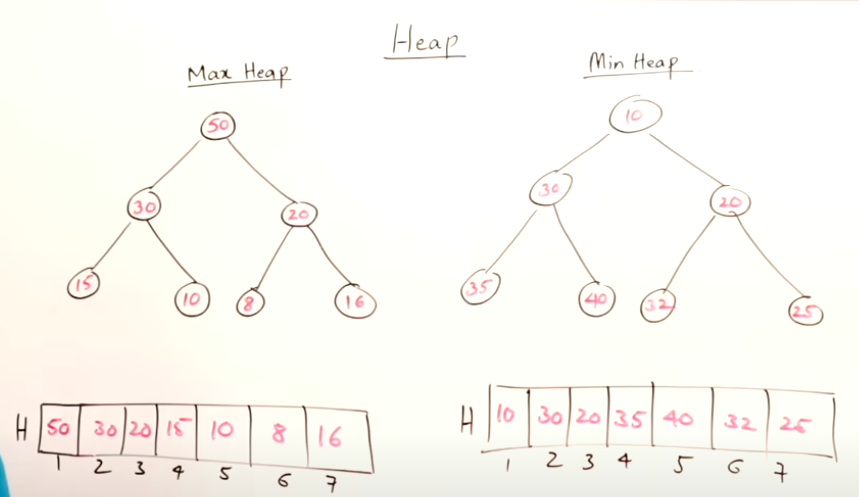
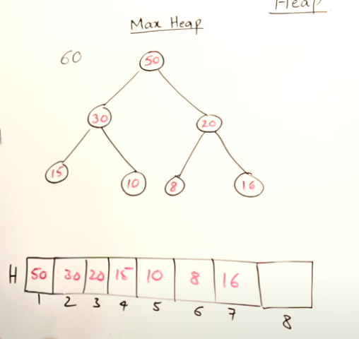
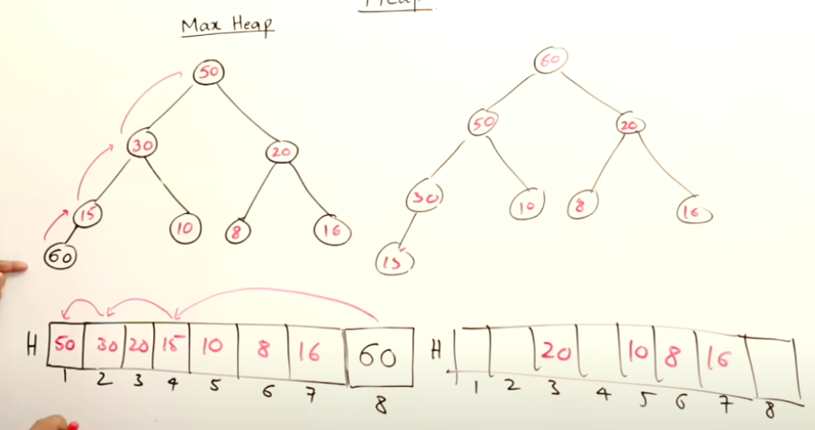
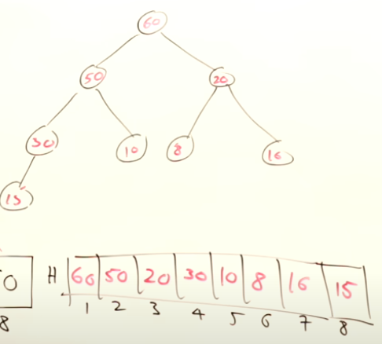
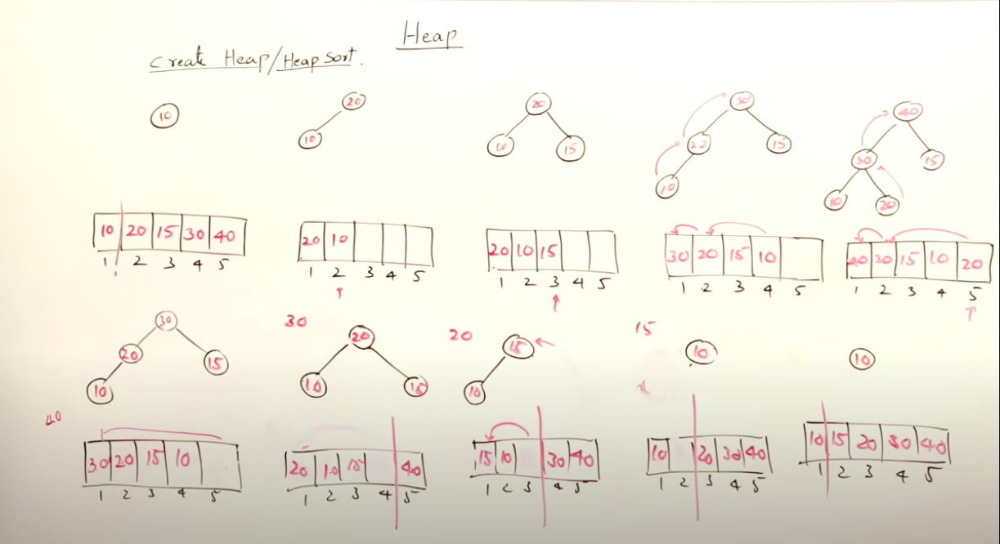
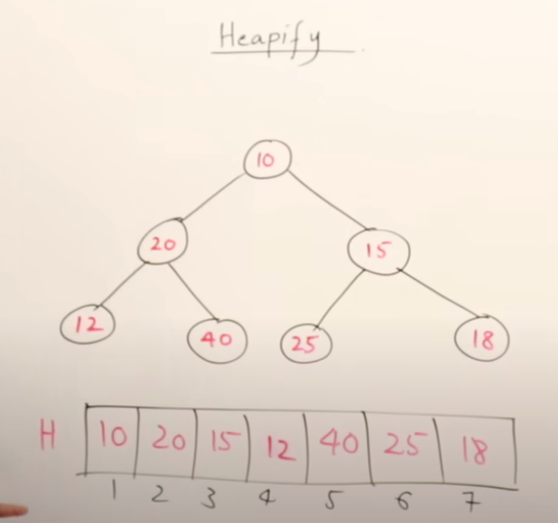

# Heaps

[Youtube](https://www.youtube.com/watch?v=HqPJF2L5h9U)

**Binary Trees:**



In binary tree, a root can have left and right.

Representation of binary trees using Arrays. For our convenience, instead of storing the root element at `index 0`, we store it on `index 1` and follow the below formula to keep the parent child relationship.

at index `i`

* to find left child:**2 * i**
* to find right child:**(2 * i) + 1**
* to find parent:**i / 2** (integer division)

**What is full binary tree?**

- In the picture, 1st one is full binary tree.
- Height of this binary tree is 0, 1, 2 and it has maximum number of nodes in this height
- if height of tree is`h`, then full binary tree can have`(2^h+1) - 1` 2power(h+1) - 1
- binary tree with maximum number of nodes is called full binary tree

**What is complete binary tree?**

- In the picture, look at 1st and 2nd binary trees, there is no missing element in the array, so this is complete
- 3rd binary tree in the picture is not complete binary tree because one or more elements are missing

**Heaps**



**Max Heap:**

* max heap is a complete binary tree, satisfying the condition that every node is having the element greater than (or equal to) all it's descendants.
* duplicates are allowed, if we have duplicates, we can have them as descendants.

**Min Heap:**

* min heap is a complete binary tree, satisfying the condition that every node is having the element less than (or equal to) all it's descendants.
* smallest element is the root of binary tree
* duplicates are allowed, if we have duplicates, we can have them as descendants.

**Max Heap Operations:**



**Insert:**

* to**insert the value 60**, we should insert it at the end of the array
* earlier, heap was ending at index 7. now heap ends at index 8 after inserting 60 (50,30,20,15,10,8,16,60)
* 60 is the left child of 15, now the constraints are broken to call this max heap
* adjust the elements to follow the max heap constraints to form the valid max heap
  * compare`60` with it's parent, which is`15` 60 > 15, so 60 should go up, swap the positions
  * compare`60` with it's new parent, which is`30` 60 > 30, so 60 should go up, swap the positions
  * compare`60` with it's new parent, which is`50` 60 > 50, so 60 should go up, swap the positions
* time taken for insertion is**O(log n)**
* height of the complete binary tree is**O(log n)**
* minimum**O(1)** to maximum of**O(log n)** swaps are required to insert the element.
* we may not need to swap at all when the value is too small to be swapped. i.e 6





**Delete:**

* We always delete the root element and the last element in complete binary tree will be placed at the root
* then, we start adjusting the tree from top to bottom (from root towards leaf)
* maximum time it can take to delete is**log n**
* whenever we delete, we always get largest number in max-heap and smallest number in min-heap

**Heap Sort:**

* **step 1: heap creation**
  * create a heap for the given set of numbers and delete all the elements from the heap
  * insert element one by one and ensure constriants are adjusted to form max-head
* **step 2: delete all numbers from heap**
  * delete from the root and the last element of the heap replaces the root
  * adjust the heap from top to bottom
  * place the deleted item at the free space we got from the heap
  * deleting n element takes**n*log n** times




*Pic: Heap Sort Representation*

> In the above picture, first row is heap creation part and second row is deleting the element, place the next element in heap on root and adjust them to form the heap
>
> Once last element is inserted on root and adjustments are complete, insert the deleted element at the free space we got after deletion

create: n log n

delete: n log n

overall: 2n log n, **O(n log n)** (2 x log n can be considered n log n in amortized form)


**Heapifying:**

It is the procedure to create the heap


  

Pic: It's a complete binary tree but not max heap or min heap


* scan from the last element of the binary tree (18), look down and there is no children and 18 alone is heap
* then goto next last element of the binary tree (25), look down and there is no children and 25 alone is heap
* 40 alone is heap
* 12 alone is heap
* **next element is 15**, look down and compare, we have 25 and 18.`25 > 15`, swap it 25 will go up and 15 will come down. now, 25, 15, 18 this forms the valid max heap
* **next element is 20**, look down and compare, we have 12 and 40.`40 > 20`, swap it 40 will go up and 20 will come down. now, 40,12,20 this forms the valid max heap

> now, our heap look like this [10,40,25,12,20,15,18]

* **next element in 10**, look down and compare, we have children 40 and 25. 40 > 10, swap it, 10 goes down and 40 goes up. heap now looks like this (40,10,25,12,20,15,18)
* again from 10, look down and compare, we have children 12 and 20. 20 > 10, 20 comes up and 10 goes down. now we no longer have leaf node for 10 after swapping it.

```
           40
     10         25
  12     20  15     18 
```


The time taken to heapify is **O(n)**

**Priority Queues:**

* elements have the priority and they are inserted and deleted based on the priority
* in priority queue, and when we want to delete, we always want to delete the highest priority element from the priority queue
* this is the discipline of priority queue to be followed
* elements are inserted with priority and deleting also we want highest priority element
